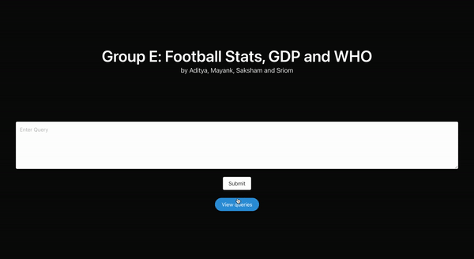

# CS7IS1

### Introduction

#### Football, GDP and WHO
In this assignment we combined the world of football with GDP and WHO to find interesting stats and facts about them.

### Frontend

Our frontend is written using HTML, CSS and JavaScript. We just need to open the index.html file in frontend directory.

### Server

Our server is made using flask. To activate the server

```bash
#changing directory
$cd server

#creating a virtual environment
$python3 -m venv venv

$source venv/bin/activate

$pip3 install -r requirements.txt

#starting our server
$python3 server.py
```

The server runs on `localhost:5000`. We can leave the server running in the background.

### Database

For our database, we stored the triples in the GraphDb triplestore. The directories in `Data` are

* Datasets: Our CSV datasets
* Mappings: Our R2RML mappings. It also contains the configs when we need to use the r2rml engine to uplift the dataset
* Outputs: The `.ttl` files generated from after running the r2rml engine which then would be uploaded to our triplestore

To uplift the data, just run `./update_ttl.sh` in the Data directory.

**NOTE**: The `appearances.ttl` file is too large to upload using normal method. We need to create a directory `~/graphdb-import` and move the appearances.ttl there. Only then it can be imported to our triplestore. See [this](https://graphdb.ontotext.com/documentation/standard/loading-data-using-the-workbench.html#importing-server-files) for further information.


The GraphDb server runs on `localhost:7200`. The name of our repository is `group_e_football`.

### Documentation

To see the ontology, r2rml and sparql queries documentation, please run a live server in the directory `Documentation/groupE_OntologyDocumentation/` and access the index-en.html file in this directory.

Although you can access the `index-en.html` directly, however, if you do not run the live server, you may not be able to see the webVowl visualization of the ontology.

### Demo



